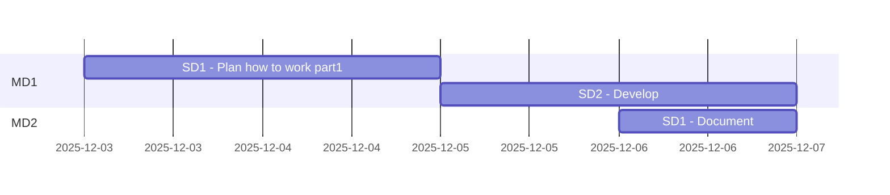

Title: Project management
Description: plans and project management sheets
Date: 
Robots: noindex,nofollow
Template: index
---

# Sublime-text plugins

Abbreviations
> * PM Product Milestone
> * MD Milestone division
> * SD Subdivision


## Analyzing all parts

|#|Part|Details|Total Duration|Status|
|:-|:-|:-|:-|:-|
|1|[Develop](%base_url%/pm#Develop_timeplan)|2025-12-03 - |- hours|ONGOING|
|2|[Maintenance](%base_url%/pm#Maintenance_timeplan)|-|- hours|-|
|:-|:-|:-|::||


## Develop timeplan



## Maintenance timeplan

```mermaid
gantt
    section MD1
```

# Stories/cards MD1 - Develop

## Stories left over from [Sublime-text plugins](https://github.com/hoss-java/sublime-plugins/blob/main/DECK.md)

>## 51-001
>### DicSwitcher 
><details>
>    <summary>Details</summary>
>
>>The goal of this card is add a new plugin to Sublime to make it easy to switch between languages
>>
>>### DOD (definition of done):
>>Add some hotkeys to switch between Swedish and english
>>Finings are documented.
>>
>>### TODO :
>>- [x] 1. Document all findings
>>
>>### Reports :
>>* To make faster to type and document readme(markdown) files without using external tools to spellcheck, 
>>
>>### Steps to test and debugging:
>>- [x] 1. Document all findings
>>
>>### References :
>>* []()
></details>
>
>
>## 52-002
>### MarkdownXtra 
><details>
>    <summary>Details</summary>
>
>>The goal of this card is to develop a sublime-text plugin to enhance working with markdown files.
>>
>>### DOD (definition of done):
>>All finings are documented.
>>
>>### TODO :
>>- [x] 1. Document all findings
>>
>>### Reports :
>>* 
>>
>>### Steps to test and debugging:
>>- [] 1.
>>
>>### References :
>>* []()
></details>
>
>
>## 52-003
>### WhiteSpaces 
><details>
>    <summary>Details</summary>
>
>>The goal of this card is to develop a sublime-text plugin to manage whitespaces.
>>
>>### DOD (definition of done):
>>All finings are documented.
>>
>>### TODO :
>>- [x] 1. Document all findings
>>
>>### Reports :
>> *
>>
>>### Steps to test and debugging:
>> *
>>
>>### References :
>>* []()
></details>
>
>
>## 52-004
>### Maven
> <details open>
><summary>Details</summary>
>
>>The goal of this card is to develop a sublime-text plugin to enhance working with Maven projects
>>
>>### DOD (definition of done):
>>All finings are documented.
>>
>>### TODO :
>>- [ ] 1. Document all findings
>>
>>### Reports :
>>#### Steps
>>* Step 1 - Find the folder path right clicked on the side bar
>>> * Find the root path of the side bar 
>>> * Find absolute path of the selected item on the side bar 
>>> * Find relative path of the selected item on the side bar 
>> * Step 2 - Make the menu and other commands items dynamic
>>> * Update the `get_sidebar_folder.py` to use as the Maven plugin base
>>> * Change the static menu to a dynamic menu 
>>> * Add path to the menu group title 
>> * Step 3 - check a selected folder on the side bar is a Maven project folder/file
>>> * A selected item is inside a Maven project if the current selected folder or one of upper level folders has a `pom.xml` stored in 
>>> * The upper level folders are scanned to find `pom.xml` up to the root folder inside of the side bar 
>>> * Perhaps a xml check for `pom.xml` is required 
>> * Step 4 - Reading/saving settings
>>> * Add a settings file and its loading method 
>> * Step 5 - Adapt the Maven menu
>>> * Re-code the menu part to make it easy to add new items 
>>> * Check maven availability to enable disable menu items
>>> * Assign commands to menu items and find appropriate path of the project according to the method to run maven (host base or container base)
>>> * In the case of a container base maven if the project path cannot be converted to a known path for the container, the menu items are disabled
>>> * Finalize command implementation and find a solutions or way to show command running outputs
>>> * Work on the create command, adding types, and find how to ask the name of the project
>>> * List features than can be added later, not now with this card
>>### Steps to test and debugging:
>>- [] 1.
>>
>>### References :
>>* []()
></details>

# Stories/cards MD2 - Develop


# Stories/cards MD1 - Maintenance