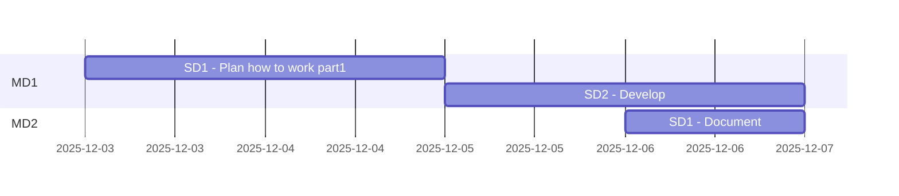

Title: Project management
Description: plans and project management sheets
Date: 
Robots: noindex,nofollow
Template: index
---

# Sublime-text plugins

Abbreviations
> * PM Product Milestone
> * MD Milestone division
> * SD Subdivision


## Analyzing all parts

|#|Part|Details|Total Duration|Status|
|:-|:-|:-|:-|:-|
|1|[Develop](%base_url%/pm#Develop_timeplan)|2025-12-03 - |- hours|ONGOING|
|2|[Maintenance](%base_url%/pm#Maintenance_timeplan)|-|- hours|-|
|:-|:-|:-|::||


## Develop timeplan



## Maintenance timeplan

```mermaid
gantt
    section MD1
```

# Stories/cards MD1 - Develop

## Stories left over from [Sublime-text plugins](https://github.com/hoss-java/sublime-plugins/blob/main/DECK.md)

>## 51-001
>### DicSwitcher 
><details>
>    <summary>Details</summary>
>
>>The goal of this card is add a new plugin to Sublime to make it easy to switch between languages
>>
>>### DOD (definition of done):
>>Add some hotkeys to switch between Swedish and english
>>Finings are documented.
>>
>>### TODO :
>>- [x] 1. Document all findings
>>
>>### Reports :
>>* To make faster to type and document readme(markdown) files without using external tools to spellcheck, 
>>
>>### Steps to test and debugging:
>>- [x] 1. Document all findings
>>
>>### References :
>>* []()
></details>
>
>
>## 52-002
>### MarkdownXtra 
><details>
>    <summary>Details</summary>
>
>>The goal of this card is to develop a sublime-text plugin to enhance working with markdown files.
>>
>>### DOD (definition of done):
>>All finings are documented.
>>
>>### TODO :
>>- [x] 1. Document all findings
>>
>>### Reports :
>>* 
>>
>>### Steps to test and debugging:
>>- [] 1.
>>
>>### References :
>>* []()
></details>
>
>
>## 52-003
>### WhiteSpaces 
><details>
>    <summary>Details</summary>
>
>>The goal of this card is to develop a sublime-text plugin to manage whitespaces.
>>
>>### DOD (definition of done):
>>All finings are documented.
>>
>>### TODO :
>>- [x] 1. Document all findings
>>
>>### Reports :
>> *
>>
>>### Steps to test and debugging:
>> *
>>
>>### References :
>>* []()
></details>
>
>
>## 52-004
>### Maven 
><details>
><summary>Details</summary>
>
>>The goal of this card is to develop a sublime-text plugin to enhance working with Maven projects
>>
>>### DOD (definition of done):
>>All finings are documented.
>>
>>### TODO :
>>- [ ] 1. Document all findings
>>
>>### Reports :
>>* 
>>
>>### Steps to test and debugging:
>>- [] 1.
>>
>>### References :
>>* []()
></details>

# Stories/cards MD2 - Develop


# Stories/cards MD1 - Maintenance